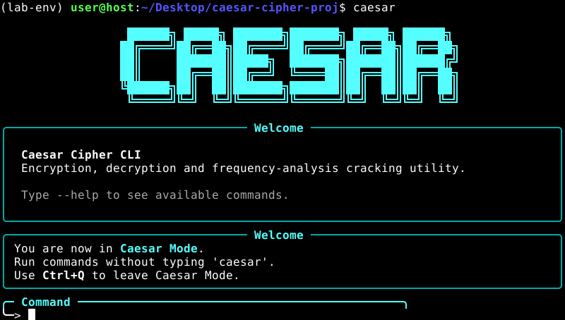

<div align="center">

```text
   ██████╗ █████╗ ███████╗███████╗ █████╗ ██████╗
  ██╔════╝██╔══██╗██╔════╝██╔════╝██╔══██╗██╔══██╗
  ██║     ███████║█████╗  ███████╗███████║██████╔╝
  ██║     ██╔══██║██╔══╝  ╚════██║██╔══██║██╔══██╗
  ╚██████╗██║  ██║███████╗███████║██║  ██║██║  ██║
   ╚═════╝╚═╝  ╚═╝╚══════╝╚══════╝╚═╝  ╚═╝╚═╝  ╚═╝
```


</div>

A command-line tool for encrypting, decrypting, and automatically cracking Caesar-shift ciphers — built with [Typer](https://typer.tiangolo.com/) and [Rich](https://github.com/Textualize/rich), with an interactive shell mode and statistical cryptanalysis built in.

## Features

- **Encrypt / Decrypt** with any shift key (0–25)
- **Crack without a key** — ranks all 26 possible shifts using chi-squared analysis against standard English letter frequencies
- **Interactive "Caesar Mode"** shell — run commands without retyping `caesar` each time
- **Flexible I/O** — pass text directly, read from a file, or pipe input via stdin; write results to a file or stdout
- **Readable output** — formatted tables and colored panels via `rich`

## Installation

```bash
git clone https://github.com/azevedtheo/caesar.git
cd caesar
pip install -e .
```

Requires Python 3.10+.

## Usage

<div align="center">



</div>

### Encrypt / Decrypt

```bash
encrypt "hello world" --key 3
# Encrypted: khoor zruog

decrypt "khoor zruog" --key 3
# Decrypted: hello world
```

Read from a file and write to another:

```bash
encrypt --input-file plain.txt --output-file cipher.txt --key 7
```

Pipe input through stdin:

```bash
echo "attack at dawn" | encrypt --key 5
```

### Crack a cipher (no key needed)

```bash
crack "khoor zruog"
```

Shows a ranked table of the most likely plaintexts, best guess first. Use `--top` to control how many candidates are shown, or `--all` to see all 26 shifts:

```bash
crack "khoor zruog" --top 3
crack "khoor zruog" --all
```

### Interactive mode

Run `caesar` with no arguments to enter Caesar Mode, where you can run `encrypt`, `decrypt`, and `crack` repeatedly without retyping the program name:

```bash
$ caesar
╰─> encrypt "hello" -k 4
╰─> crack "lipps"
╰─> exit
```

## How the cracking works

Every language has a distinctive letter-frequency fingerprint — in English, `E` and `T` show up far more often than `Q` or `Z`. For each of the 26 possible shifts, the tool decrypts the ciphertext and measures how far the resulting letter distribution deviates from that expected English fingerprint, using a chi-squared statistic. The shift that produces the closest match to real English is ranked first — no key required.

## Project structure

```
src/caesar_cipher/
├── __init__.py     # package exports
├── cipher.py        # CaesarCipher: encrypt, decrypt, brute-force shift generation
├── analyzer.py       # FrequencyAnalyzer: chi-squared scoring and ranking
├── constants.py       # alphabet constants and reference English letter frequencies
├── utils.py           # shared I/O helpers (read_input, write_output, validate_key)
└── main.py             # Typer CLI app + interactive shell
```

## Contributing

Issues and pull requests are welcome. Please run `pytest` before submitting a PR.

## License

Licensed under the MIT License — see [LICENSE](LICENSE).
